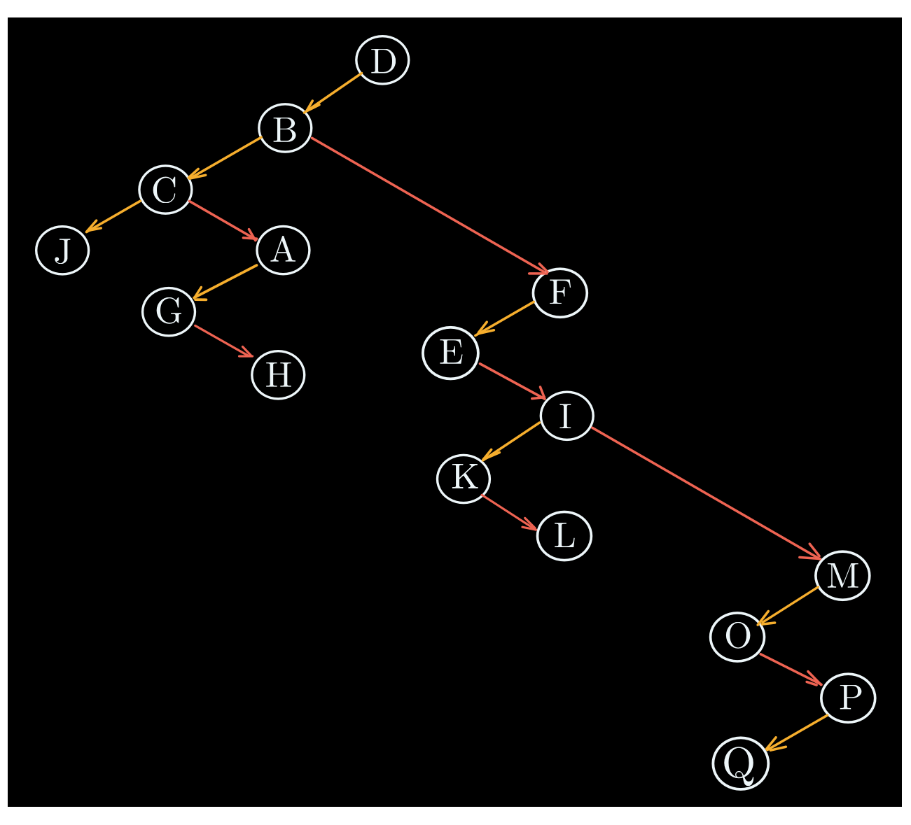
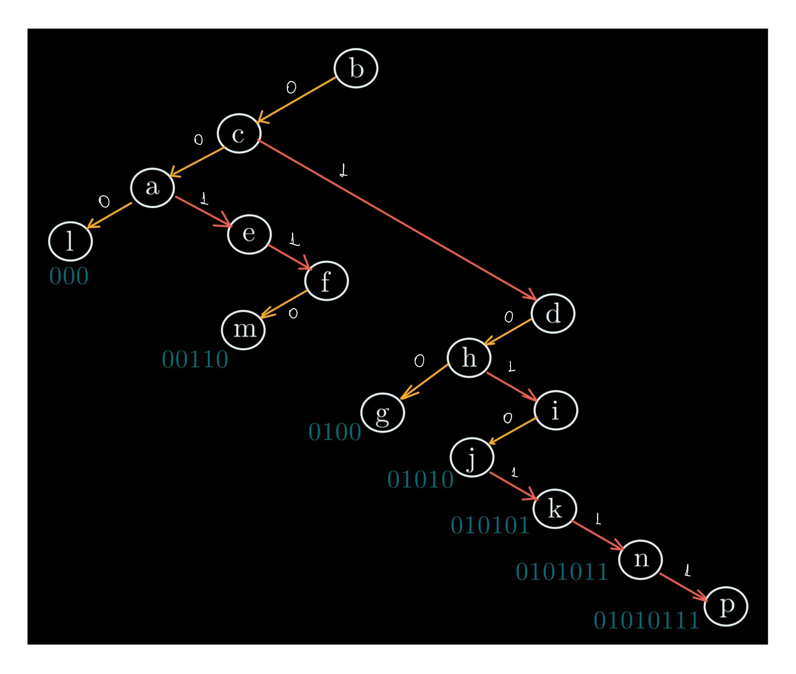
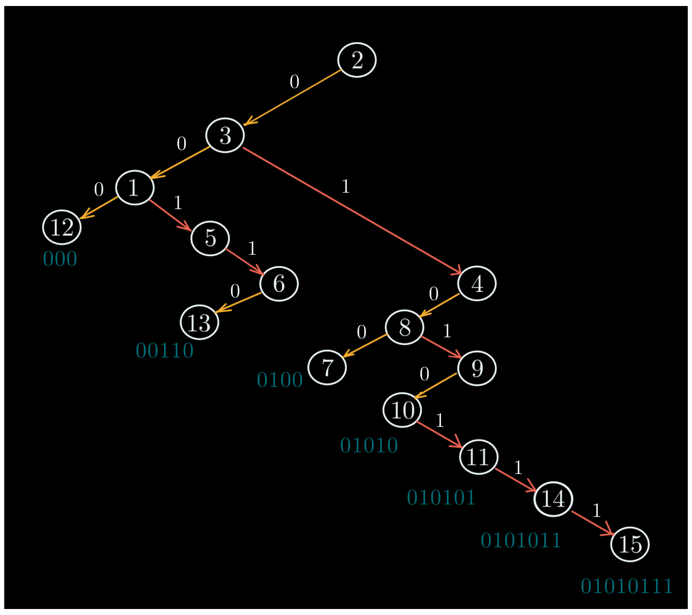

# Trees (árboles)

## Ejercicio 1

Sea $A=\{ v_1, v_2, v_3, v_4, v_5, v_6, v_7, v_8, v_9, v_{10} \}$ el conjunto de todos los vértices de un grafo T tal que:

$$T = \{(v2, v3 ), (v2, v1 ), (v4, v5 ), (v4, v6 ), (v5, v8 ), (v6, v7 ), (v4, v2 ), (v7, v9 ), (v7, v10)\}$$

**Se pide**

Mostrar que $T$ es un árbol, además de su raíz, altura, hojas y tipo de n-árbol que es.

**Resolución**

Se puede notar, primero que nada, que el set $T$ es un set de pares ordenados, esto quiere decir que, para un par de vértices de $T$ cualquiera (tómese $(a, b)$), entonces $(a, b)$ no necesariamente es igual a $(b, a)$.

Esto quiere decir que estamos ante un árbol dirigido $T$ que se ve así:

Podemos decir que es un árbol puesto que cumple con:

- [X] Es un grafo no cíclico (bipartito)
- [X] Para 3 vértices cualesquiera que tomemos, sólo existe 1 camino posible para viajar del primero al último.
- [X] Existen 10 vértices y 9 aristas.

El nodo raíz del 3-árbol es $v_4$, su altura es 3. Además, sus hojas son el conjunto $A$ tal que:

$$A = \{ v_3, v_1, v_8, v_9, v_{10} \}$$

## Ejercicio 2

Dado el árbol $T$ tal que:

$$T = \{ (B, C), (F, E), (F, I), (F, M), (A, G), (A, H), (C, J), (D, B), (D, F), (B, A), (I, K), (I, L), (M, O), (M, P), (P, Q) \}$$

**Se pide**

- Trace el dígrafo del árbol $T$ ordenado, indicando la raíz y el tipo de n-árbol.
- Trace el dígrafo del árbol binario posicional $B(T)$ formado a partir del árbol $T$ ordenado.
- Verifique que el contenido de los arreglos *LEFT*, *DATA* y *RIGHT* es:

**Resolución**

El 3-árbol dirigido $T$ de raíz $D$ se ve así:

Para armar el árbol binario posicional del dígrafo podemos empezar por conectar entre sí los nodos hijos de cada hoja con hijos.

Luego para cada uno de los nodos padres, dejaremos solamente la arista que esté más a la izquierda de todas. De esta forma, el árbol binario posicional del dígrafo resulta:

<table>
<tr>
<td style="width: 60%;">

</td>
<td style="width: 200%;">

</td>
</tr>
</table>

## Ejercicio 3

Dado el árbol $T$ cuyos elementos son:

$$T = \{ (a, l), (b, c), (c, a), (c, e), (c, f), (d, h), (d, i), (f, m), (i, j), (i, k), (i, n), (h, g), (i, p) \}$$

**Se pide**

- Trazar el dígrafo del árbol $T$ ordenado, indicando la raíz y el tipo de n - árbol.
- Trazar el dígrafo del árbol binario etiquetado $B(T)$ formado a partir del árbol $T$ ordenado.
- Determinar el contenido de los arreglos *LEFT*, *DATA* y *RIGHT*.

**Resolución**

Siguiendo el set de pares del 4-árbol $T$ de raíz $b$, el dígrafo resulta ser:

Y siguiendo el mecanismo anterior, esta sería su representación binaria y su, subsecuente, arreglo:

<table>
<tr>
<td style="width: 60%;">

</td>
<td style="width: 300%;">

</td>
</tr>
</table>

## Ejercicio 4

Dado el arreglo *LEFT*, *DATA*, *RIGHT*:

**Se pide**

- Trazar el dígrafo del árbol binario posicional $B(T)$ relacionado al arreglo.
- Trazar el dígrafo del árbol $T$ original ordenado, indicando la raíz y el tipo de n-árbol.

**Resolución**

Siguiendo el arreglo, el dígrafo $B(T)$ se ve así:

Si tomamos las conexiones rojas como las uniones extra que se explicaron en ejercicios anteriores, podemos tomarlas también como indicador de agrupamiento, formando así el 3-árbol $T$ de raíz $F$ que se ve así:

## Ejercicio 5

Dado el árbol $T$:

$$T = \{ (1, 12), (2, 3), (2, 4), (3, 1), (3, 5), (3, 6), (4, 8), (4, 9), (6, 13), (9, 10), (9, 11), (9, 14), (8, 7), (9, 15) \}$$

**Se pide**

- Trazar el dígrafo del árbol $T$ ordenado, indicando la raíz y el tipo de n - árbol.
- Trazar el dígrafo del árbol binario etiquetado $B(T)$ formado a partir del árbol $T$ ordenado.
- Determinar el contenido de los arreglos *LEFT*, *DATA* y *RIGHT*.

**Resolución**

Traspasando el conjunto de pares de vértices, el 4-árbol $T$ con raíz $2$ queda así:

Mientras que su representación binaria $B(T)$ queda así:

<table>
<tr>
<td style="width: 60%;">

</td>
<td style="width: 200%;">

</td>
</tr>
</table>

## Ejercicio 6

Dado el árbol $T$:

$$T = \{ (E, B), (E, C), (E, F), (B, A), (B, G), (C, K), (F, H), (F, I), (F, J), (A, L), (H, M) \}$$

**Se pide**

- Trazar el dígrafo del árbol $T$ ordenado, indicando la raíz y el tipo de n - árbol.
- Trazar el dígrafo del árbol binario etiquetado $B(T)$ formado a partir del árbol $T$ ordenado.
- Determinar el contenido de los arreglos *LEFT*, *DATA* y *RIGHT*.

**Resolución**

Traspasando el conjunto de pares de vértices, el 4-árbol $T$ con raíz $2$ queda así:

Mientras que su representación binaria $B(T)$ queda así:

<table>
<tr>
<td style="width: 60%;">

</td>
<td style="width: 200%;">

</td>
</tr>
</table>

